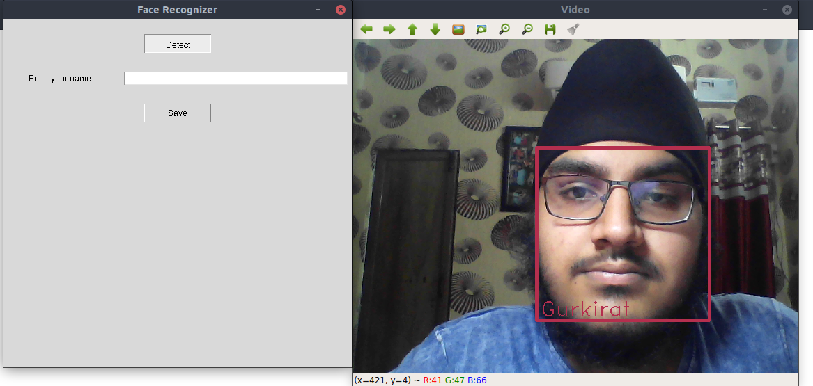

## Introduction
Tried out my hands at ML. Created a simple face recognizer app in python.
This app can detect multiple faces and assign them names in real time using your webcam.
If faces were scanned earlier.

## Screenshots



## Making
Its a normal face recognizer with gui in tkinter. It saves/reads
data of faces from faces.csv using pandas.

## Installation

Needs Anaconda to run a package cv2.
First off all create a virtual environment in conda.

```bash
$ conda create -n face_app
$ conda activate face_app
```

Works best if you have a GPU and cuda installed.
In that case first compile dlib using cuda and follow the steps 
below.

Install dependencies : 
```bash
$ bash install.sh
```

## Running
Just type
```bash
$ python main.py
```

## Instructions
* To detect 
    - just click **Detect**.
    - Press **q** to close the 'Video' window or click the cross icon. 
* To scan a new face:
    - Enter your name in given area.
    - Click **Scan**.
    - When no warnings are shown and a rectangle is around your
    face, press **q** to scan your face or just close the window with cross icon. 
    
#### Contact
Feel free to contact me at:

:email: gurkirat.singh@students.iiit.ac.in